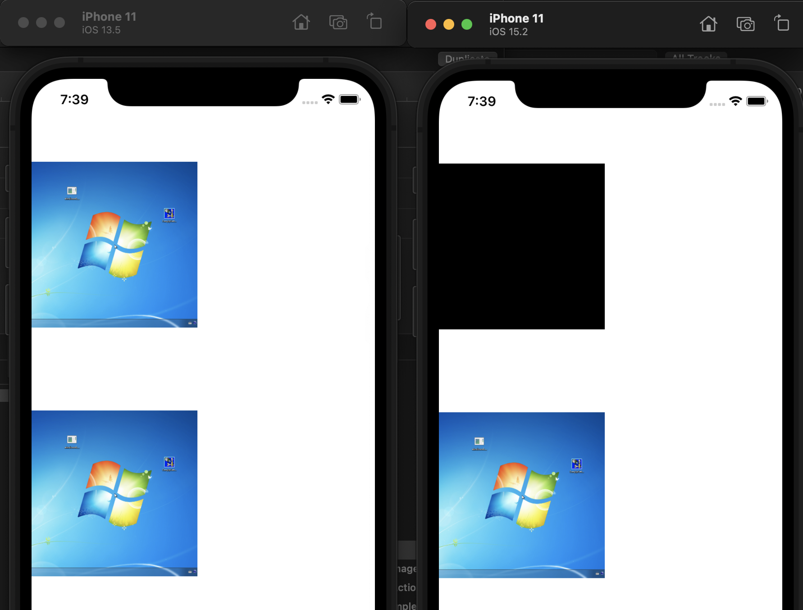

# Bug

iOS 15+ only:

+ Wrong behavior:

When create non-alpha CGImage from CGBitmapContext with bitmap format BGRX8888, the created CGImage will always been black.
When create non-alpha CGImage from CGBitmapContext with bitmap format BGRA8888, the created CGImage will works correctly.

- Designed behavior:

Both BGRX8888 or BGRA8888 should draw image correctly, as previous works on iOS 6.0-14.8

# Demo

+ Open `CGContextDrawImageBug.xcodeproj`
+ Build and run on iOS 14/iOS 15 device
+ See difference result: iOS 14 show two image view with image correctly. While iOS 15 show first black and another correctly.

# Screenshot

